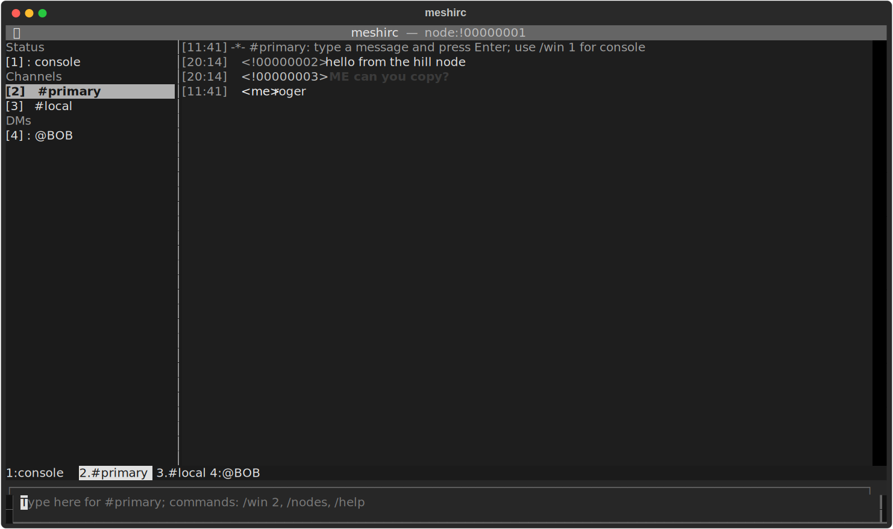

# meshirc

Terminal chat client for Meshtastic. The UI is built around IRC-style buffers,
channels and direct messages.

## Screenshot



## Install

```bash
git clone git@github.com:pawel-cygal/meshirc.git
cd meshirc
python3.11 -m venv .venv
.venv/bin/pip install -e .
```

For a local workstation command:

```bash
ln -sf "$PWD/.venv/bin/meshirc" "$HOME/.local/bin/meshirc"
```

## Run

By default `meshirc` uses serial auto-discovery:

```bash
meshirc
```

To choose a specific USB device:

```bash
meshirc devices        # or: meshirc --list-devices
meshirc --serial /dev/ttyACM0
```

TCP mode is useful when a Meshtastic node is exposed through the Meshtastic TCP
interface:

```bash
meshirc --transport tcp --host 192.168.1.50 --port 4403
```

Default config path:

```text
~/.config/meshirc/config.toml
```

## Config

```toml
[connection]
transport = "serial"
host = "127.0.0.1"
port = 4403
serial_device = ""

[ui]
sidebar_default = true
scrollback = 2000
timestamp_format = "%H:%M"

[behavior]
mention_words = []
auto_open_dm = true

[archive]
enabled = true
path = ""
```

When `archive.path` is empty, messages are stored in:

```text
~/.local/state/meshirc/archive.sqlite3
```

Set `archive.enabled = false` to disable local history.

## Typical Setup

One node can sit outside as the better radio position. A second node can stay
plugged into Linux over USB and act as the local terminal endpoint. `meshirc`
talks to that local node, and the node forwards messages over the mesh.

Example flow:

```text
Linux terminal -> meshirc -> USB/TCP Meshtastic node -> LoRa mesh
```

## First Steps

After connecting you will see buffers like `1:console`, `2:#chan0` or
`2:#chan1`. The console shows status and help. Click a channel in the left sidebar
or switch to it from the input line:

```text
Alt+2
hello from linux
```

`Alt+2` is supported directly and for terminals that emit `²` for that key chord.
If your terminal still does not pass it correctly, press `Tab`, choose a buffer with arrows, and press `Enter`.

Useful checks:

```text
/nodes              show known mesh nodes
/msg BOB hello      send a direct message by short name
/query BOB          open a DM buffer
/history 20         show archived messages for the current buffer
```

## Channels and DMs

Meshtastic exposes configured channel slots from the device. `meshirc` shows only
active channels and uses their configured names when available. Empty primary
channel names are displayed as `#primary`; unnamed secondary channels are shown as
`#channel-N`.

Direct messages are opened as `@shortname` buffers. Use `/msg <node> <text>` to
start a DM, or `/query <node>` to open the buffer without sending.

## Keys

| Key | Action |
|---|---|
| `Tab` on empty input | focus the buffer list |
| `Up/Down` + `Enter` in buffer list | choose a buffer |
| `Esc` | focus the input line |
| `Alt+1..9` | switch to buffer N |
| `Ctrl+N` / `Ctrl+P` | next/previous buffer |
| `Alt+B` | toggle sidebar |
| `Alt+Left/Right` | prev/next buffer |
| `Up/Down` in input | command history |
| `Tab` | autocomplete |
| `Ctrl+C` | copy selected text, or the current buffer when nothing is selected |
| `Ctrl+V` | paste from the system clipboard into the input line |
| `Ctrl+Q` | quit |

## Clipboard

`meshirc` tries to use the desktop clipboard before falling back to the
terminal clipboard:

```bash
sudo apt install xclip          # X11
sudo apt install wl-clipboard   # Wayland
```

On X11, `xclip` enables copying from MeshIRC and pasting text copied from other
apps, such as Slack. On Wayland, install `wl-clipboard` for `wl-copy` and
`wl-paste`.

`Ctrl+C` copies selected text when the terminal/Textual selection is active;
otherwise it copies the whole current buffer. Mouse selection works through
Textual selection. If the terminal itself needs to select raw screen text, hold
`Shift` while selecting in many terminal emulators.

## Commands

```text
/help
/quit
/win N                 switch to buffer N; alias: /w
/buffers               toggle sidebar; alias: /buf
/close
/copy
/clear
/me <action>
/nodes
/msg <node> <text>
/query <node>          open a DM buffer; alias: /q
/join <#chan|N>
/connect [target]
/history [limit]
```

`/connect` reconnects to the current target when no argument is passed. In TCP
mode the target can be `host` or `host:port`. In serial mode it can be a device
path such as `/dev/ttyACM0`.

## Develop

```bash
.venv/bin/pip install -e ".[dev]"
.venv/bin/pytest
.venv/bin/ruff check .
```
